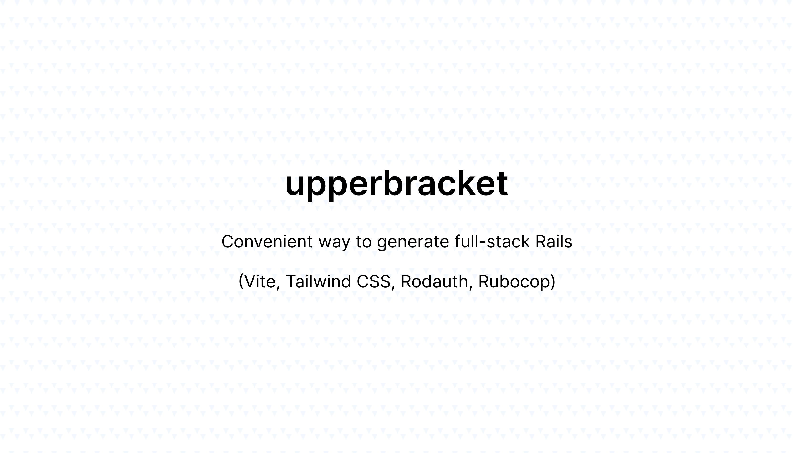

<p align="center">
  
</p>

# UpperBracket

Convenient way to generate full-stack Ruby on Rails application

## Batteries Included 🔋

- [strong_migrations](https://github.com/ankane/strong_migrations)
- [dotenv-rails](https://github.com/bkeepers/dotenv)
- [vite_rails](https://vite-ruby.netlify.app/)
- [aasm](https://github.com/aasm/aasm)
- [simple_form](https://github.com/heartcombo/simple_form)
- [discard](https://github.com/jhawthorn/discard)
- [local_time](https://github.com/basecamp/local_time)
- [sidekiq](https://github.com/sidekiq/sidekiq)
- [pagy](https://github.com/ddnexus/pagy)
- [draper](https://github.com/drapergem/draper)
- [inline_svg](https://github.com/jamesmartin/inline_svg)
- [rodauth-rails](https://github.com/janko/rodauth-rails)
- [prettier](https://prettier.io)
- [tailwindcss](https://tailwindcss.com)
- [action_policy](https://github.com/palkan/action_policy)
- [phosphor-icons](https://github.com/maful/ruby-phosphor-icons)
- [sidekiq-cron](https://github.com/sidekiq-cron/sidekiq-cron)
- [pry](https://github.com/pry/pry)
- [rubocop](https://github.com/rubocop/rubocop)
- [rubocop-rails](https://github.com/rubocop/rubocop-rails)
- [rubocop-shopify](https://ruby-style-guide.shopify.dev)

## Usage

To generate a Rails application using this template, pass the `-m` option to `rails new`, like this:

```
rails new blog \
  -d postgresql \
  -m https://raw.githubusercontent.com/maful/upperbracket/main/template.rb
```

**The only database supported by this template is postgresql.**

## Contributing

If you're interested in contributing to UpperBracket, please read our [contributing docs](https://github.com/maful/upperbracket/blob/main/CONTRIBUTING.md) **before submitting a pull request**.

## License

UpperBracket is open-source software licensed under the MIT License. This means you're free to use, modify, and distribute the software as you see fit, subject to certain conditions outlined in the license. For more details, please see the [LICENSE](https://github.com/maful/upperbracket/blob/main/LICENSE) file.
